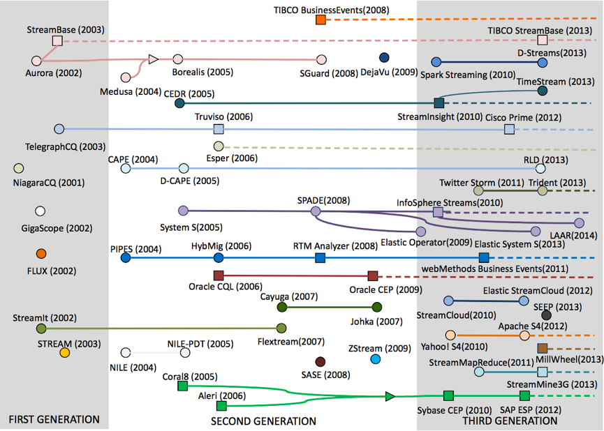

# 历史

[链接](http://midlab.diag.uniroma1.it/articoli/paper%2066.pdf)

## 第一代

## 第二代
事件、事务
## 第三代
日志处理（大数据）

## 参考资料

1. [Tutorial: Cloud-based Data Stream Processing](http://midlabTutorial: Cloud-based Data Stream Processing.diag.uniroma1.it/articoli/paper 66.pdf)
